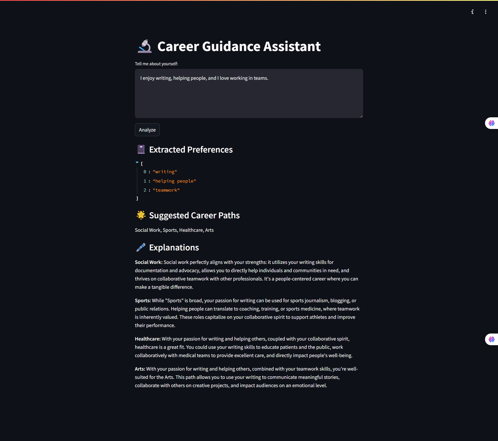

# 💼 MedGuardian: AI-Powered Career Guidance Bot

An intelligent web app built using **Google Gemini API** and **Streamlit** that helps users discover career paths based on their interests, skills, and values. Ideal for students and career changers looking for AI-backed career advice.

---

## 🔍 Project Overview

**MedGuardian** is an AI-powered system originally developed for early disease detection (e.g., diabetes, heart attacks). This evolved version now focuses on **career guidance** using natural language understanding.

Users describe what they enjoy or are good at, and the app:

- Extracts career-related preferences
- Matches them to career paths like STEM, Arts, Business, etc.
- Provides short, AI-generated explanations
- Asks for more detail if user input is unclear

---



---

## 🚀 Features

- 🔑 Uses Gemini 1.5 API (Pro or Flash) for NLP
- 🧠 Extracts interests, skills, and values from free text
- 🎯 Matches to career paths using keyword-based mapping
- 📘 Provides AI-based 2–3 line career explanations
- 🛡️ Includes fallback prompts for vague inputs
- ⚡ Instant results through Streamlit UI

---

## 🧱 Tech Stack

- **Frontend**: Streamlit
- **AI Model**: Google Gemini 1.5 (Pro or Flash)
- **Backend**: Python
- **Libraries**: `google-generativeai`, `json`, `re`, `streamlit`

---

## 🛠️ Setup Instructions

### 1. Clone the Repository

```bash
git clone https://github.com/your-username/career-guidance-bot.git
cd career-guidance-bot
```

### 2. Install Required Packages

```bash
pip install streamlit google-generativeai
```

### 3. Add Your Gemini API Key

In your Python file (e.g., `career_guidance_app.py`), configure the API:

```python
import google.generativeai as genai
genai.configure(api_key="YOUR_GEMINI_API_KEY")
```

> 🔐 It's recommended to store your API key securely using environment variables.

### 4. Run the Streamlit App

```bash
streamlit run career_guidance_app.py
```

---

## ✍️ Sample Inputs

```text
"I enjoy writing, helping people, and I love working in teams."

"I'm passionate about technology, solving problems, and analyzing data."

"I love sports, teamwork, and staying fit."
```

---

## 🏷️ License

This project is open source under the MIT License.
